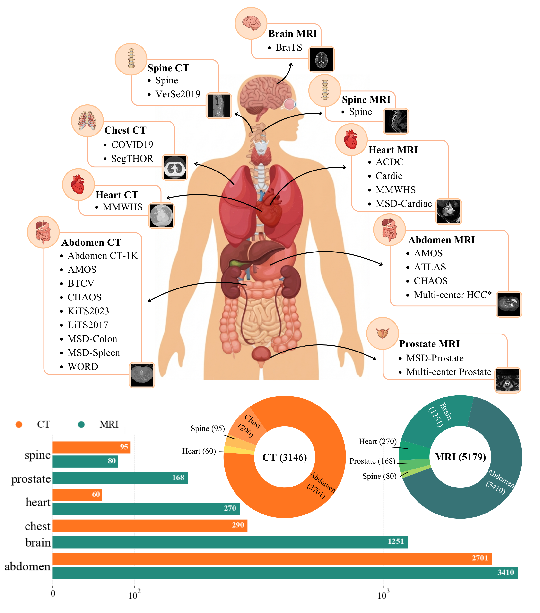

# MedVAR: Next-scale Autoregressive Medical Image Generation 🩻📈

<div align="center">

[](https://arxiv.org/abs/2602.14512)&nbsp;
[](https://arxiv.org/pdf/2602.14512.pdf)&nbsp;
[](#)&nbsp;
[](#)&nbsp;
[](https://arxiv.org/abs/2602.14512)

</div>

<p align="center" style="font-size: larger;">
  <a href="https://arxiv.org/abs/2602.14512">
    MedVAR: Towards Scalable and Efficient Medical Image Generation via Next-scale Autoregressive Prediction
  </a>
</p>

<div>
  <p align="center" style="font-size: larger;">
    <strong>Next-scale autoregressive foundation model for multi-organ CT/MRI generation</strong>
  </p>
</div>

<p align="center">
  
</p>

<br>

## News
* **2026-02:** MedVAR arXiv preprint released.
* **2026-xx:** Code & checkpoints coming soon.
* **2026-xx:** (Planned) Hugging Face weights and tokenizer release.

---

## What's New?

### 🔥 MedVAR brings next-scale prediction to medical image synthesis 🧠🩺
MedVAR adapts **Visual Autoregressive Modeling** to medical imaging and reformulates generation as **coarse-to-fine next-scale prediction** rather than raster-scan next-token prediction. This makes sampling **fast, scalable, and stable** for 256×256 medical slices while preserving anatomical structure.

<p align="center">
  
</p>

### ⚡ Fast sampling without step-heavy diffusion
Diffusion models improve fidelity by increasing denoising steps but pay a linear runtime cost. MedVAR generates an image in **10 scales** (instead of ~100 steps) and achieves strong quality–efficiency trade-offs.

### 📈 Scalable transformers for medical generation
We observe consistent improvements as model size scales from **310M → 2B**, improving anatomical sharpness and fine texture fidelity while keeping sub-second latency.

### 🧩 Multi-organ & multi-modality coverage
MedVAR is trained on a harmonized corpus spanning multiple anatomies and both CT/MRI. Below shows representative multi-domain generations.

<p align="center">
  <!-- Multi-domain samples: use Fig.6-style grid -->
  
</p>

---

## MedVAR Zoo
We provide MedVAR models (coming soon). The table format follows common AR “zoo” conventions for easy comparison.

|   model    | reso. |   FID↓   | time/image | #params | weights |
|:----------:|:-----:|:--------:|:----------:|:------:|:-------:|
| MedVAR-d16 |  256  |  16.59   |   0.09s    | 310M   | coming soon |
| MedVAR-d20 |  256  |  10.70   |   0.11s    | 600M   | coming soon |
| MedVAR-d24 |  256  |  10.11   |   0.13s    | 1.0B   | coming soon |
| MedVAR-d30 |  256  |  10.11   |   0.16s    | 2.0B   | coming soon |

> Notes  
> - Inference time is measured under consistent hardware/settings reported in the paper.  
> - “Weights” and tokenizer checkpoints will be linked once released.

---

## Dataset
MedVAR is trained on a **harmonized multi-organ CT/MRI dataset** (~438,905 curated 2D slices) covering abdomen/brain/chest/heart/prostate/spine with modality-specific normalization and geometric standardization. Details and dataset list are provided in the paper.

<p align="center">
  
</p>

---

## Evaluation
We report fidelity, diversity, and scalability using:

- **FID**, **RadFID**
- **KID**, **CMMD**
- **Efficiency metric** balancing quality and runtime:
  \[
  \text{Efficiency} = Q \cdot (\log(1 + P))^\gamma
  \]
  where \(Q\) is FID and \(P\) is inference time (lower is better).

---

## Installation (coming soon)
1. Install `torch>=2.0.0`.
2. `pip install -r requirements.txt`
3. Prepare datasets / folder structure (to be released).

---

## Training Scripts (coming soon)
We will provide training scripts for:
- Medical multi-scale VQVAE tokenizer training
- Next-scale transformer training (dataset-conditioned, CFG-ready)
- Logging, checkpointing, and evaluation

---

## Sampling & Inference (coming soon)
We will provide:
- `infer.py` / `sample.py` for unconditional/conditional sampling
- CFG + top-k/top-p configuration templates
- Utilities to export image grids and metrics

---

## Third-party Usage and Research
If your work uses MedVAR or builds on next-scale AR medical generation, feel free to open an issue and we can list it here.

---

## License
TBD (will be released with code).

---

## Citation
If our work assists your research, feel free to give us a star ⭐ or cite us using:

```bibtex
@misc{he2026medvarscalableefficientmedical,
      title={MedVAR: Towards Scalable and Efficient Medical Image Generation via Next-scale Autoregressive Prediction}, 
      author={Zhicheng He and Yunpeng Zhao and Junde Wu and Ziwei Niu and Zijun Li and Lanfen Lin and Yueming Jin},
      year={2026},
      eprint={2602.14512},
      archivePrefix={arXiv},
      primaryClass={cs.CV},
      url={https://arxiv.org/abs/2602.14512}, 
}
